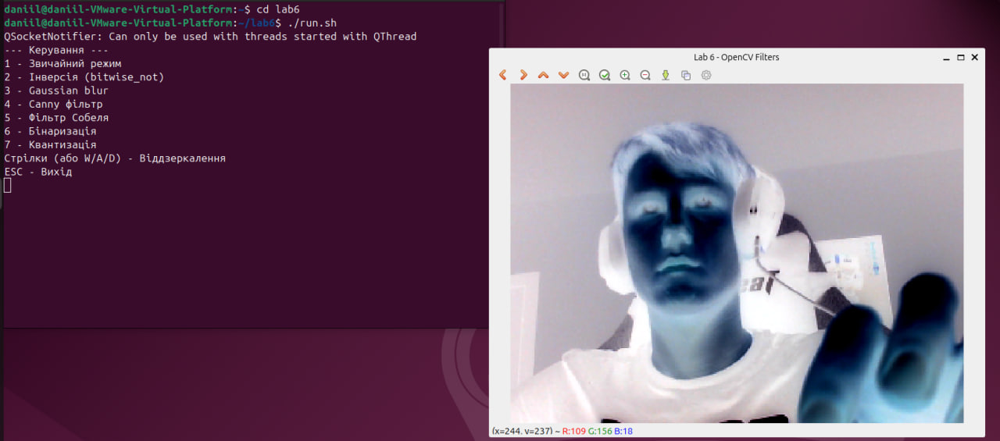

# Лабораторна робота №6: Обробка відеопотоку за допомогою OpenCV (C++)

---

## Опис проєкту

Ця лабораторна робота містить C++ програму, розроблену з використанням бібліотеки комп'ютерного зору OpenCV. Додаток призначений для захоплення відеопотоку з веб-камери в реальному часі та застосування до нього різноманітних матричних фільтрів і математичних трансформацій зображення.

Проєкт логічно розділений за принципами об'єктно-орієнтованого програмування (ООП) і має модульну архітектуру (окремі класи для камери, обробки натискань, застосування фільтрів та відображення вікон). 

---

## Демонстрація роботи



---

## Основний функціонал

* **Захоплення відео:** Отримання кадрів з веб-камери в реальному часі за допомогою бекенду `V4L2`, який оптимізовано для стабільної роботи в Linux-середовищах.
* **Базові трансформації (Попіксельні операції):**
  * *Інверсія кольорів* (`bitwise_not`).
  * *Бінаризація* (перетворення у чорно-біле зображення за допомогою `cv::threshold`).
  * *Квантизація* (зменшення кількості кольорів для створення ефекту "постеризації").
* **Матричні згортки та складні фільтри:**
  * *Gaussian blur*: Розмиття зображення для усунення цифрових шумів.
  * *Canny фільтр*: Виділення контурів (меж) об'єктів у кадрі.
  * *Фільтр Собеля*: Створення ефекту рельєфності шляхом обчислення градієнтів по осях X та Y.
* **Геометричні перетворення:** Горизонтальне та вертикальне віддзеркалення зображення (через `cv::flip`).
* **Інтерактивне керування:** Безперервна зміна режимів "на льоту" за допомогою клавіатури (без необхідності зупиняти відеопотік).

---

## Інструкція із запуску (Важливо!)

Проєкт повністю адаптовано для збірки та запуску в операційній системі Linux (Ubuntu). Для максимальної зручності локального розгортання передбачено спеціальні bash-скрипти.

### Крок 1. Отримання коду та налаштування прав

1. Відкрийте термінал та клонуйте репозиторій:
   ```bash
   git clone https://github.com/Lokum549/DataAnalysis.git
Перейдіть у директорію проєкту:

Bash
cd ВашРепозиторій
Надайте системі права на виконання скриптів:

Bash
chmod +x preinstall.sh build.sh run.sh
(Примітка: Якщо під час запуску скриптів виникне помилка \r: command not found, це означає конфлікт форматів кінця рядка Windows/Linux. Вирішується командою: dos2unix *.sh)

### Крок 2. Встановлення залежностей середовища
Виконайте скрипт попереднього встановлення. Він автоматично завантажить потрібні компілятори (gcc, g++), систему збірки (cmake) та бібліотеку комп'ютерного зору (libopencv-dev):

Bash
./preinstall.sh
(Може знадобитися введення пароля адміністратора sudo).

### Крок 3. Компіляція (Збірка) проєкту
Запустіть скрипт конфігурації та збірки. Він створить системну директорію build, згенерує Makefile через CMake та скомпілює вихідний код у готовий виконуваний файл Lab6:

Bash
./build.sh
Дочекайтеся появи повідомлення [100%] Built target Lab6.

### Крок 4. Запуск програми
Виконайте в терміналі команду для старту обробки відеопотоку:

Bash
./run.sh
Керування (Гарячі клавіші)
Після відкриття вікна Lab 6 - OpenCV Filters використовуйте наступні клавіші:

1 — Звичайний режим (Оригінал)

2 — Інверсія кольорів

3 — Розмиття (Gaussian blur)

4 — Canny фільтр (Контури)

5 — Фільтр Собеля (Рельєф)

6 — Бінаризація (Чорно-біле)

7 — Квантизація

Стрілка Вліво (або A) — Віддзеркалення по горизонталі

Стрілка Вгору (або W) — Віддзеркалення по вертикалі

Стрілка Вправо (або D) — Повернення до нормального відображення

ESC — Закрити програму та завершити процес

Особливості роботи на віртуальних машинах (VMware / VirtualBox):
Якщо замість відео з веб-камери ви бачите зелений, сірий екран або зображення "рветься" горизонтальними смугами — це системна проблема втрати пакетів на віртуальному USB-контролері, а не помилка коду.
Рішення: Вимкніть віртуальну машину (Power Off) та у її налаштуваннях змініть версію сумісності USB Controller з USB 2.0 на USB 3.1 (або навпаки).
