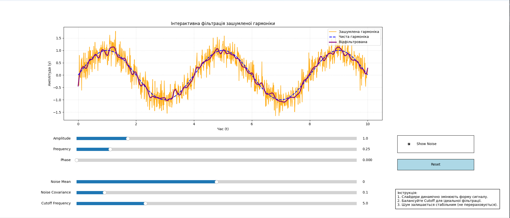

# Лабораторна робота №4: Інтерактивна візуалізація та фільтрація сигналів

## Опис завдання

Ця лабораторна робота присвячена розробці інтерактивного графічного додатка для моделювання, зашумлення та подальшої цифрової фільтрації гармонічного сигналу. Програму реалізовано мовою Python з використанням віджетів керування бібліотеки Matplotlib.

## Основний функціонал програми

Програма складається з трьох ключових математичних блоків, керування якими здійснюється через інтерактивний графічний інтерфейс:

### 1. Генерація базової гармоніки
За допомогою повзунків користувач може динамічно змінювати форму хвилі:
* **Amplitude (Амплітуда):** Змінює розмах коливань хвилі по вертикалі (висоту "піків").
* **Frequency (Частота):** Визначає кількість коливань за одиницю часу. Збільшення цього параметра візуально "стискає" графік по горизонталі, роблячи хвилі щільнішими.
* **Phase (Фазовий зсув):** Плавно зсуває графік хвилі вліво або вправо вздовж осі часу (від 0 до $2\pi$).

### 2. Накладання контрольованого шуму
Додавання до чистого сигналу гауссового шуму для симуляції реальних перешкод. 
* **Noise Mean (Математичне сподівання):** Зміщує загальний рівень шуму вгору або вниз по осі Y відносно самої гармоніки.
* **Noise Covariance (Дисперсія/Коваріація):** Керує "силою" або розкидом шуму. При збільшенні цього параметра амплітуда шумових викидів зростає, сильніше спотворюючи оригінальний сигнал.
* **ВАЖЛИВА ОСОБЛИВІСТЬ:** Базовий масив випадкового шуму генерується **лише один раз** під час запуску скрипта. Це гарантує, що при зміні параметрів гармоніки (амплітуди чи частоти) візерунок шуму залишається "прив'язаним" до сигналу і не генерується наново, що дозволяє коректно оцінювати результати фільтрації.
* **Чекбокс "Show Noise":** Дозволяє миттєво приховати помаранчевий зашумлений графік, щоб детально порівняти роботу фільтра з оригінальною чистою гармонікою.

### 3. Цифрова фільтрація
Очищення сигналу в реальному часі за допомогою низькочастотного фільтра Баттерворта 3-го порядку (`scipy.signal.butter`). Для уникнення фазового зсуву використовується функція прямого та зворотного фільтрування `filtfilt`.
* **Cutoff Frequency (Частота зрізу):** Найголовніший параметр фільтрації. Визначає межу, вище якої всі частоти (тобто дрібний "гострий" шум) будуть відрізані. 
  * *Менше значення* робить фіолетову лінію дуже гладкою, але може "з'їсти" амплітуду самої гармоніки. 
  * *Більше значення* пропускає більше оригінального сигналу, але разом з ним пропускає і частину високочастотного шуму. Користувач має знайти ідеальний баланс за допомогою цього повзунка.

### 4. Допоміжні функції
* **Кнопка "Reset":** Миттєво скидає всі 6 повзунків до їхніх початкових значень, повертаючи програму до базового стану.

## Демонстрація роботи (Скріншот)

*(На графіку: синя суцільна лінія — чиста гармоніка, помаранчева — зашумлений сигнал, червона пунктирна лінія — результат роботи фільтра).*

---

## Вимоги до системи

* **Операційна система:** Windows / macOS / Linux
* **Версія інтерпретатора:** Python 3.9 або новіше
* **Залежності:** `numpy`, `matplotlib`, `scipy`. Усі необхідні пакети вказані у файлі `requirements.txt`.

---

## Інструкція із запуску

1. Відкрийте термінал у теці `lab_4`.
2. Створіть та активуйте віртуальне середовище (за потреби): `python -m venv venv` та `venv\Scripts\activate`
3. Встановіть необхідні залежності командою: 
   `pip install -r requirements.txt`
4. Запустіть головний скрипт програми:
   `python Lab-4.py`
5. У вікні, що з'явиться, використовуйте повзунки для взаємодії з моделлю в реальному часі.
