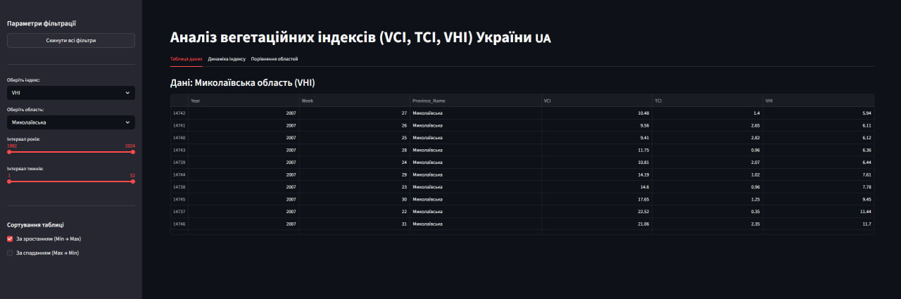

# Лабораторна робота №5: Веб-додаток для аналізу вегетаційних індексів (NOAA)

## Опис проєкту
Цей репозиторій містить інтерактивний веб-додаток, створений за допомогою фреймворку **Streamlit**. Додаток призначений для зручного аналізу, фільтрації та візуалізації супутникових даних NOAA (індекси VHI, VCI, TCI) для різних областей України. 

Робота логічно продовжує Лабораторну №2: сирі дані завантажуються та очищуються скриптом, а потім передаються у веб-інтерфейс для користувацького аналізу.

## Демонстрація роботи


## Основний функціонал
* **Інтерактивна фільтрація:** Вибір конкретного індексу (VHI, VCI, TCI), області, діапазону років та тижнів за допомогою зручних Dropdown-списків та слайдерів.
* **Сортування:** Можливість сортування таблиці даних за зростанням або спаданням (із захистом від конфліктів при виборі обох опцій).
* **Скидання налаштувань:** Кнопка "Скинути всі фільтри" для швидкого повернення до початкового стану (реалізовано через `st.session_state`).
* **Багатовіконна візуалізація (Tabs):**
  1. **Таблиця даних:** Відображення відфільтрованого датафрейму.
  2. **Графік динаміки:** Інтерактивний лінійний графік часового ряду (Plotly Express) для обраної області.
  3. **Порівняння областей:** Інтерактивна стовпчаста діаграма (Plotly Express), яка порівнює середнє значення індексу серед усіх областей за обраний період, з кольоровим підсвічуванням цільової області.

---

## Інструкція із запуску (Важливо!)

Оскільки сирі CSV-файли з даними ігноруються системою Git (знаходяться у `.gitignore`), для локального запуску програми потрібно виконати наступні кроки:

### Крок 1. Отримання даних
1. Відкрийте файл `Part1.ipynb` (скрипт з Лабораторної №2) у середовищі Jupyter або VS Code.
2. Запустіть першу комірку коду, яка містить функцію `download_vhi_data`.
3. Дочекайтеся повідомлення **"Завантаження завершено!"**. У директорії автоматично з'явиться папка `vhi_data` із необхідними CSV-файлами.

### Крок 2. Налаштування середовища
1. Відкрийте термінал у папці з проєктом.
2. (Опціонально) Створіть та активуйте віртуальне середовище:
   `python -m venv venv`
   `venv\Scripts\activate` (для Windows)
3. Встановіть необхідні бібліотеки з файлу залежностей:
   `pip install -r requirements.txt`

### Крок 3. Запуск веб-додатка
Виконайте в терміналі команду:
```bash
streamlit run lab5.py
